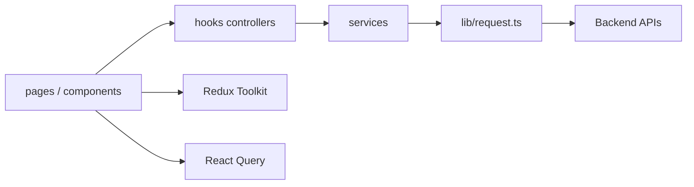

# XunZhi Agent Frontend


XunZhi Agent Frontend 是一个基于 `React + TypeScript + Vite` 的前端应用仓库，服务于智能对话、模拟面试、简历解析与面试报告等核心体验。

这个仓库以“前端独立开源”形态维护：

- 保留真实后端 API 接入方式
- 不内置 mock/demo 后端
- 重点保障本地联调体验、工程质量和公开协作能力

## Core Features

- 智能对话：多会话聊天、模型选择、流式返回、推理内容展示
- 模拟面试：简历上传、题目推进、追问、摄像头行为采集
- 简历预览：PDF 预览、简历得分、岗位方向与建议展示
- 面试报告：雷达图、问答回放、结论与复盘信息
- 工程化基础：ESLint、Vitest、Husky、commitlint、GitHub CI

## Tech Stack

- React 19
- TypeScript 5
- Vite 7
- React Router 7
- Redux Toolkit
- TanStack React Query
- Tailwind CSS
- Radix UI / shadcn-style primitives
- Vitest + Testing Library

## Interface Notes

仓库当前聚焦以下主要界面：

- `Home`: 对话入口与模型选择
- `Chat`: 多轮会话与流式内容展示
- `Interview`: 简历驱动的模拟面试主流程
- `Interview Report`: 结构化复盘与能力雷达
- `Auth`: 登录 / 注册入口

本轮收尾已将路由页面与 PDF 预览模块切为懒加载，避免所有重量级页面与 `react-pdf` 常驻首屏主包。

## Architecture



更完整的前端分层、组件树和数据流图见：

- [docs/frontend-architecture.md](./docs/frontend-architecture.md)

## Requirements

- Node.js `20+`
- npm `10+`
- 可访问的后端 API 服务

## Quick Start

1. 安装依赖

```bash
npm install
```

2. 复制环境文件

```bash
cp .env.example .env.development
```

Windows PowerShell:

```powershell
Copy-Item .env.example .env.development
```

3. 按需修改 `.env.development`

4. 启动开发环境

```bash
npm run dev
```

默认地址：`http://localhost:5173`

## Environment Variables

推荐将本地联调配置写在 `.env.development`，生产构建配置写在部署平台环境变量中。

| Variable | Default | Description |
| --- | --- | --- |
| `VITE_API_BASE_URL` | `/api` | 前端请求前缀，`axios` 与部分请求 URL 拼接都依赖它 |
| `VITE_API_TARGET` | `http://localhost:8002` | Vite 本地开发代理目标地址 |
| `VITE_WS_BASE_URL` | empty | 可选的 WebSocket 基础地址覆盖项 |

环境解析统一走 [`src/config/env.ts`](./src/config/env.ts)，不要在业务代码里直接散落读取 `import.meta.env`。

## Backend Integration

该仓库不是全栈单仓，运行时依赖外部后端接口。

最小联调要求：

- 后端提供 HTTP API
- 本地开发时允许通过 `VITE_API_TARGET` 代理到后端
- 如果语音或流式能力需要 WebSocket，请确认后端地址可从浏览器访问

已落地的工程约定：

- HTTP 请求统一经由 [`src/lib/request.ts`](./src/lib/request.ts)
- 环境变量统一经由 [`src/config/env.ts`](./src/config/env.ts)
- 全局 Provider 统一经由 [`src/app/providers.tsx`](./src/app/providers.tsx)
- 路由定义统一经由 [`src/app/router.tsx`](./src/app/router.tsx)

## Scripts

| Script | Description |
| --- | --- |
| `npm run dev` | 启动 Vite 开发服务器 |
| `npm run build` | TypeScript build + 生产构建 |
| `npm run preview` | 本地预览生产包 |
| `npm run lint` | 运行 ESLint |
| `npm run test` | 启动 Vitest 监听模式 |
| `npm run test:run` | 单次执行 Vitest |
| `npm run test:ci` | CI 使用的稳定测试入口 |
| `npm run typecheck` | TypeScript no-emit 校验 |
| `npm run check` | lint + typecheck + test:ci |
| `npm run format` | 使用 Prettier 格式化 |

## Quality Gate

提交前至少执行：

```bash
npm run check
npm run build
```

仓库已启用：

- `husky`
- `lint-staged`
- `commitlint`
- GitHub Actions CI

本地与 CI 使用同一套门禁命令，避免“本地能过、远端不过”的分叉。

## Project Structure

```text
src/
  app/         application bootstrap, providers, router
  components/  reusable UI and domain components
  config/      environment parsing and runtime configuration
  hooks/       page controllers and reusable hooks
  layouts/     route layout shells
  lib/         transport, shared utilities, error model
  pages/       route-level screens
  services/    API and websocket integrations
  store/       Redux store and slices
  types/       shared domain types
```

## Engineering Conventions

- 页面负责组装，不承载复杂流程细节；复杂状态流优先下沉到 hooks / services
- 服务端状态优先走 React Query，本地会话与 UI 状态走 Redux 或局部 state
- 新增跨模块工具函数时，优先补对应单测
- 对后端返回结构做兼容层时，优先在 service 层归一化，不把接口差异暴露到页面层
- 新增重型依赖时，优先评估是否需要懒加载或单独 chunk

## Development Workflow

日常开发建议流程：

1. `npm run dev` 启动本地开发
2. 修改代码并补测试
3. `npm run lint`
4. `npm run typecheck`
5. `npm run test:ci`
6. `npm run build`
7. 发起 Pull Request

## FAQ

### 1. 为什么仓库仍然是 `private: true`？

这是一个应用仓库而不是 npm 包。保留 `private: true` 是为了防止误发布到 npm，不影响 GitHub 开源协作。

### 2. 没有后端能跑起来吗？

页面能启动，但核心业务依赖真实 API。这个仓库当前不内置 mock 模式。

### 3. 为什么要把 PDF 预览拆成懒加载？

`react-pdf` 和 `pdf.worker` 体积较大，常驻首屏会明显抬高主包。现在只在简历预览实际打开时加载。

### 4. 路由为什么改成懒加载？

聊天、面试、报告是天然的大页面，按路由切分后可以显著降低首屏下载成本，也更符合开源项目长期维护的性能基线。

## Contributing

欢迎提交 Issue 和 Pull Request。开始之前请先阅读：

- [CONTRIBUTING.md](./CONTRIBUTING.md)
- [CODE_OF_CONDUCT.md](./CODE_OF_CONDUCT.md)
- [SECURITY.md](./SECURITY.md)

## Release Notes

仓库当前以源码交付为主，不做 npm 发版。变更记录统一维护在：

- [CHANGELOG.md](./CHANGELOG.md)

## License

本项目采用 [MIT License](./LICENSE)。
