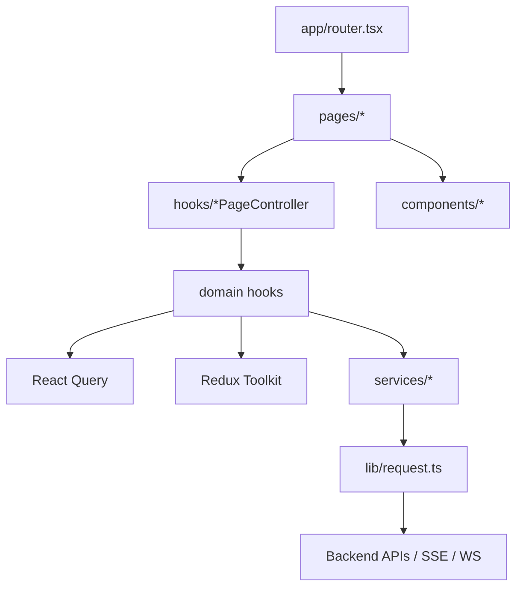
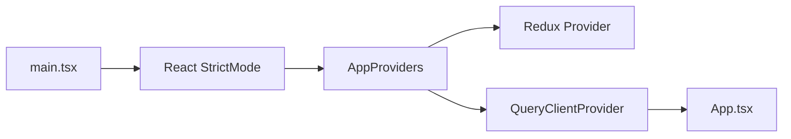
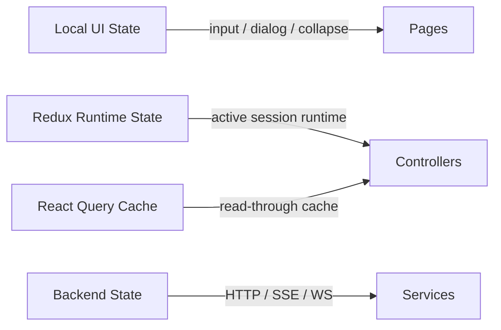
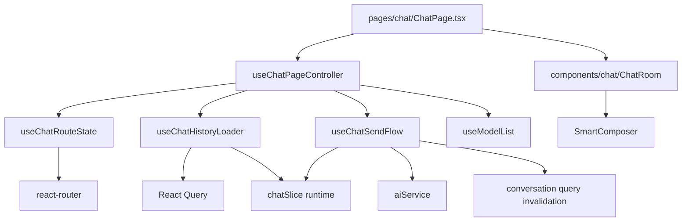
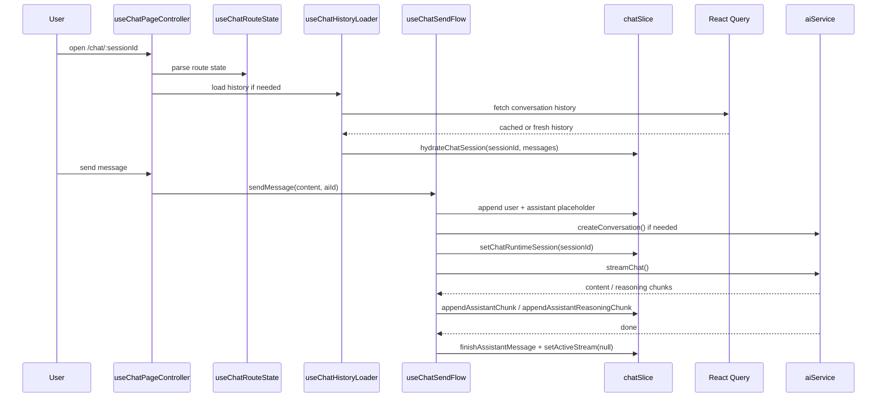
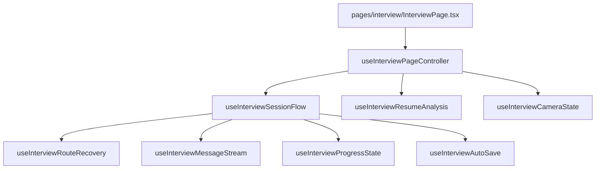
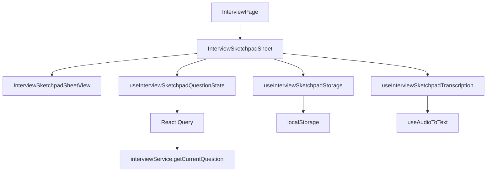
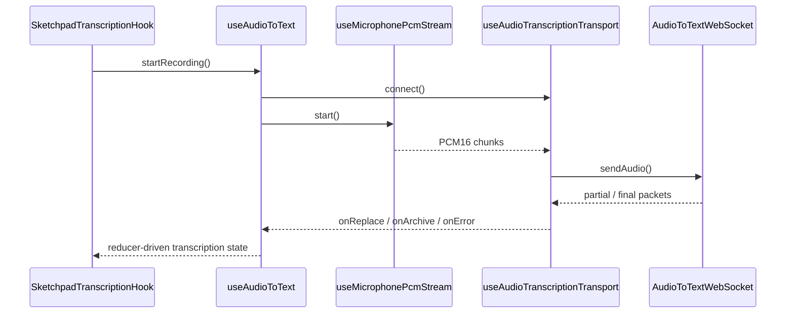
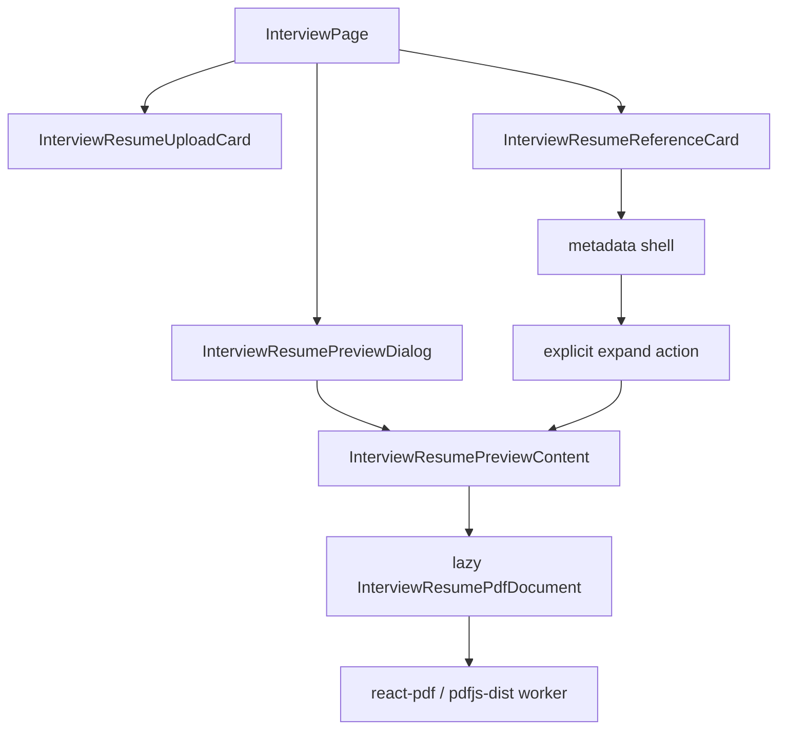

# Frontend Architecture

This document describes the current frontend layering, state ownership rules, and the main data flows for chat, interview, and sketchpad/audio transcription features.

## 1. Layered Architecture

### Responsibilities

- `app/`: app entry, top-level providers, router registration
- `pages/`: route composition layer that wires controllers and UI blocks
- `components/`: reusable UI and domain widgets
- `hooks/`: page controllers, domain flows, runtime coordination, infra hooks
- `services/`: API adapters, protocol compatibility, normalization
- `store/`: active runtime state owned by Redux
- `lib/`: shared helpers, request wrappers, generic infrastructure

## 2. Runtime Providers

## 3. State Ownership Rules

- Local interaction state stays near the component or domain hook that consumes it.
- Server read caching belongs to React Query.
- Active runtime session state belongs to Redux.
- Backend field normalization belongs to services or shared helpers, not pages.

## 4. Chat Route Architecture

### Chat boundaries

- `useChatRouteState`: parses `sessionId`, `initialQuery`, and model selection from routing state
- `useChatHistoryLoader`: loads and hydrates existing session history into runtime state
- `useChatSendFlow`: creates sessions when needed, streams chunks, and finishes runtime messages
- `chatSlice`: single write entry point for active chat runtime UI state

### Chat data flow

## 5. Interview Route Architecture

### Interview boundaries

- `useInterviewSessionFlow`: interview main-flow composition layer
- `useInterviewRouteRecovery`: restores route, storage, and recent active session context
- `useInterviewMessageStream`: thinking indicator, fake stream output, and message sequencing
- `useInterviewProgressState`: question progress, follow-up state, finish state, and scores
- `useInterviewAutoSave`: completion-side persistence and invalidation

## 6. Current Engineering Rules

- Pages compose flows; they do not own low-level side effects.
- Runtime state changes should go through slice actions rather than ad-hoc setters across the tree.
- Query owns read caching; Redux owns the active runtime interaction state.
- When a hook starts mixing routing, persistence, streaming, and UI mutations, split it into private domain hooks before adding features.
- High-risk flow changes must be backed by hook-level tests, not only page smoke tests.

## 7. Sketchpad and Audio Transcription Boundaries

### UI shell vs process hooks vs infra hooks

- Presentation components render UI and local visual interactions only.
- Process hooks own business sequencing, derived state, and user action orchestration.
- Infra hooks and services own browser APIs, media streams, WebSocket/SSE wiring, and persistence adapters.

### Interview sketchpad structure

### Audio transcription data flow

### Decision rules for future refactors

- Do not let page or component files hold storage IO, media device access, and server query orchestration at the same time.
- If a UI module needs refs, timers, storage, and remote synchronization together, split it into a shell plus private hooks before adding new features.
- Keep transcription text state inside React reducer state; keep transport and microphone handles in infra refs only.

## 8. Resume Preview Loading Boundary

- The preview dialog keeps the full resume review flow.
- The side reference card mounts metadata immediately but only mounts the PDF viewer after an explicit expand action.
- Heavy PDF parsing stays behind the preview boundary instead of piggybacking on sketchpad open state.
